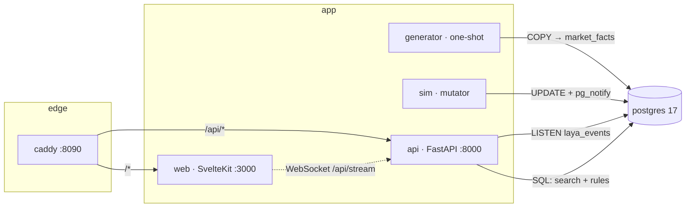

# laya-research

A containerised research bench for grocery-market decision patterns: a ~7M-row
`(day, store, product)` datasheet, structured + full-text search over it, a declarative
rule engine that turns it into explicit decisions, and a UI that moves while the data moves.

Everything runs under Docker Compose. One command, no host dependencies beyond Docker.

```bash
cp .env.example .env
make up          # build + start; first run also generates the datasheet
open http://localhost:8090
```

First boot takes a few minutes: it generates ~7M fact rows and streams them into Postgres
with `COPY`. Subsequent `up` runs skip generation (`LAYA_MODE=ensure`).

---

## Architecture



| service | role | lifecycle |
|---|---|---|
| `db` | Postgres 17, schema applied from `db/init/01_schema.sql` | long-running, named volume |
| `generator` | deterministic datasheet generator, `COPY` into `market_facts` | one-shot, exits 0 |
| `api` | search, rule engine, signal persistence, WebSocket fan-out, single `LISTEN` connection | long-running |
| `sim` | mutates the newest day every few seconds, `pg_notify`s the changed keys, refreshes rollups | long-running |
| `web` | SvelteKit dashboard, client-rendered | long-running |
| `caddy` | single ingress: `/api/*` to `api`, everything else to `web`, WS upgrade passthrough | long-running |

Why Postgres `LISTEN/NOTIFY` instead of a broker: the mutator and the reader already share the
database, notification payloads are tiny and lossy-by-design (the UI refreshes from the source of
truth on reconnect), and it removes a whole service. Boring on purpose.

---

## The datasheet

`market_facts` is `LAYA_STORES × LAYA_PRODUCTS × LAYA_DAYS` rows, default `140 × 2400 × 21`
= **7,056,000**. It is fully synthetic and deterministic: the same `LAYA_SEED` reproduces it
exactly, so results are reproducible and diffable.

```
stores        (store_id)                    region city format size_sqm opened_on
products      (product_id)                  sku name brand category subcategory uom
                                            pack_size is_private_label is_perishable
                                            list_price search_tsv  ← generated tsvector
market_facts  (day, store_id, product_id)   price unit_cost units_sold promo_flag
                                            inventory on_order
mv_product_day   (product_id, day)          units revenue cogs avg_price inventory
                                            store_count promo_stores
mv_category_day  (category, day)            units revenue cogs pl_units product_count
signals       (signal_id)                   the decision output
```

Shape of the generated reality: per-product list price, category cost ratios, demand elasticity,
weekend seasonality, per-store demand and price indices, ~8% of cells promoted with a real units
lift and a price cut, and forward cover deliberately sampled low enough that stockouts occur.

Retuning size is an env change — `LAYA_STORES=400 LAYA_PRODUCTS=4000 LAYA_DAYS=30 make up`.

---

## Decision patterns

Rules are declarative in `api/app/rules.py` and served by `GET /api/patterns`, so the UI never
hard-codes a threshold. Baselines are medians over the trailing 14 days, suppressed below 4
observations.

| pattern | scope | fires when | severity |
|---|---|---|---|
| `DEMAND_SURGE` | product | units ≥ 1.8× / 2.6× baseline | warn / critical |
| `DEMAND_COLLAPSE` | product | units ≤ 0.55× / 0.35× baseline | warn / critical |
| `PRICE_SPIKE` | product | price ≥ 1.06× / 1.15× baseline | warn / critical |
| `PRICE_CUT_UNANSWERED` | product | price ≤ 0.94× baseline and lift < 1.05 | warn |
| `MARGIN_SQUEEZE` | product | margin down > 3pp and below 18% / 10% | warn / critical |
| `STOCKOUT_RISK` | product | cover < 1.2 / 0.6 days of baseline demand | warn / critical |
| `PROMO_INEFFECTIVE` | product | ≥ 50% of stores promoting and lift < 1.15 | warn |
| `CATEGORY_DRIFT` | category | category units ≥ 1.25× / 1.6× baseline | info / warn |
| `PRIVATE_LABEL_GAIN` | category | private-label share up ≥ 2pp | info |

Every signal carries `score`, `evidence` (the numbers that fired it, as jsonb) and an `action`
sentence rendered server-side with those numbers. Signals are upserted on
`(pattern, subject_type, subject_id, day)`, so re-firing the same condition on the same day
updates one row instead of spamming the feed.

Freshness: `sim` only ever mutates the newest day, so the API recomputes *today's* rollup for the
affected products directly from `market_facts` (an index scan on the primary key) and takes earlier
days from the materialised views. Pattern latency per tick is milliseconds; the overview endpoint
reads the rollups, which the simulator refreshes concurrently every `LAYA_REFRESH_SECONDS` (30).

---

## API

Full request/response shapes: [`docs/CONTRACT.md`](docs/CONTRACT.md) §5. Summary:

```
GET  /api/health
GET  /api/meta
GET  /api/products?q=&category=&brand=&private_label=&perishable=&limit=&offset=
GET  /api/search?q=&product_id=&store_id=&category=&brand=&format=&region=&promo=
                &min_price=&max_price=&min_units=&date_from=&date_to=&sort=&limit=&offset=
GET  /api/overview?days=
GET  /api/patterns
GET  /api/signals?pattern=&severity=&subject_type=&subject_id=&since=&limit=&only_unseen=
POST /api/signals/seen            {"signal_ids":[...]}
POST /api/patterns/scan           {"day":null,"product_ids":null,"categories":null,"persist":true}
GET  /api/products/{id}/series?days=
GET  /api/categories/{category}/series?days=
WS   /api/stream
```

`q` on `/api/products` goes through `websearch_to_tsquery('english', q)` against the weighted
generated `tsvector`, ordered by `ts_rank`, with a trigram/`ILIKE` fallback for partial and
punctuation-only input. `/api/search` is the fact-grain workhorse: structured filters over 7M rows
with `totals` computed over the whole filtered set, not just the page.

### WebSocket

`/api/stream` frames — `hello` (dataset summary, always first), `tick` (which keys moved),
`signal` (a fired pattern), `heartbeat` every 20s. Clients may send
`{"type":"subscribe","patterns":[...],"severities":[...]}` to filter signal frames, and
`{"type":"ping"}`. The API holds exactly one `LISTEN` connection and fans out.

---

## Operating it

```bash
make up          # build + start everything
make ps          # container state
make health      # probe api + web through the edge
make size        # row counts, day range, datasheet on-disk size
make scan        # full rule scan, persisted, readable report
make stream      # tail the websocket for 25s (dependency-free client)
make psql        # interactive psql on the datasheet
make gen-force   # regenerate the datasheet from LAYA_SEED
make down        # stop, keep data
make reset       # stop and destroy the volume
```

### Verification

```bash
scripts/smoke.sh --up     # build, start, then assert the whole path end to end
python3 scripts/ws_probe.py --seconds 25
```

`smoke.sh` asserts the datasheet size, full-text and fact-grain search, sort/limit/totals
correctness, the rule catalog, that a real scan fires real signals with actions and evidence,
the product series, the served UI shell, and — unless run with `--fast` — that `hello` and `tick`
frames arrive and that a watched fact row actually changed while it was watching.

---

## Configuration

`.env` (see `.env.example`):

| key | default | meaning |
|---|---|---|
| `POSTGRES_USER` / `_PASSWORD` / `_DB` | `laya` | database credentials |
| `POSTGRES_PORT` | `5433` | host port for psql |
| `LAYA_SEED` | `20260926` | datasheet determinism |
| `LAYA_STORES` / `LAYA_PRODUCTS` / `LAYA_DAYS` | `140` / `2400` / `21` | datasheet size |
| `LAYA_MODE` | `ensure` | `ensure` regenerates only if missing; `force` rebuilds |
| `LAYA_TICK_SECONDS` | `4` | simulator cadence |
| `LAYA_TICK_ROWS` | `250` | fact rows mutated per tick |
| `LAYA_REFRESH_SECONDS` | `30` | rollup refresh cadence |
| `LAYA_HTTP_PORT` | `8090` | edge port |

---

## Known limits

- **The data is synthetic.** It is shaped to make the rules meaningful and is not a market forecast.
- **Notifications are lossy.** A client that misses ticks resyncs from `GET /api/overview` and
  `GET /api/signals`; frames are hints, the database is the truth.
- **Rollups lag the facts by up to `LAYA_REFRESH_SECONDS`.** Exposed in the UI as `rollups_as_of`
  and in `/api/health` as `rollup_lag_seconds` (seconds since the last refresh, stamped by the
  simulator). Pattern evaluation on the newest day is not affected — it reads the facts directly.
  A `REFRESH MATERIALIZED VIEW CONCURRENTLY` re-aggregates all of `market_facts`, measured at
  **~23 s** for the default 7M rows, so with a 30 s interval some slots are skipped by design and
  the effective cadence is `max(interval, refresh duration)`. This is the main CPU cost of the
  stack; raise `LAYA_REFRESH_SECONDS` or shrink `LAYA_DAYS` if you need the cycles back.
- **An unfiltered `/api/search` is O(dataset):** measured **~11 s** at 7M rows, because both the
  `totals` aggregate and the sort scan every row. The dashboard therefore defaults its window to
  the newest day (~336k rows, ~1.4 s) and offers `all days` / `newest day` buttons. Any filter —
  category, brand, `q`, or a date range — brings it back under 1.5 s.
- **Single API process.** The `LISTEN` connection and the WebSocket client set are per-process, so
  scaling `api` horizontally needs a shared fan-out (Redis pub/sub or `LISTEN` per replica).
- **`api` recomputes patterns for the mutated products on every tick**, serially. At
  `LAYA_TICK_ROWS=250` that is a few dozen products; raising it an order of magnitude wants a
  queue and batching.
- **`market_facts` is not partitioned.** 7M rows is comfortable; 100M+ wants `PARTITION BY RANGE (day)`.
