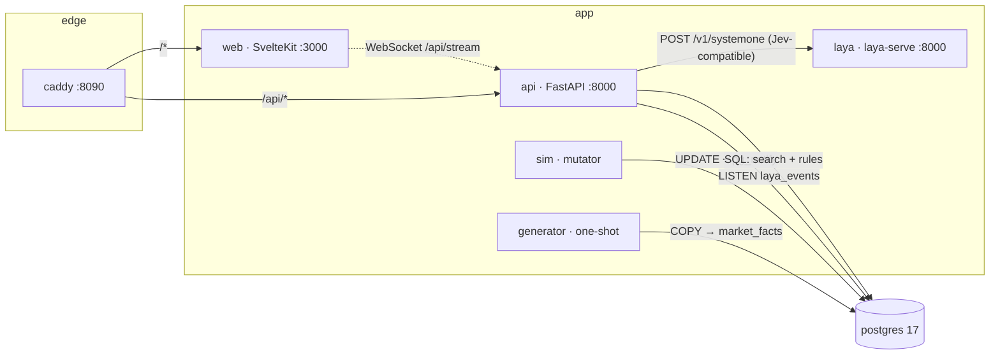

# laya-research

A containerised research bench for grocery-market decision patterns: a ~7M-row
`(day, store, product)` datasheet, structured + full-text search over it, a declarative
rule engine that turns it into explicit decisions, and a UI that moves while the data moves.

Everything runs under Docker Compose. One command, no host dependencies beyond Docker.

```bash
cp .env.example .env
make up          # build + start; first run also generates the datasheet
open http://localhost:8090
```

First boot takes a few minutes: it generates ~7M fact rows and streams them into Postgres
with `COPY`. Subsequent `up` runs skip generation (`LAYA_MODE=ensure`).

Antarmuka memakai bahasa Indonesia. Kolom pencarian paling atas menerima pertanyaan
seperti `produk mana yang stoknya menipis?`, `penjualan roti tertinggi`, atau
`sayur diskon`. SQL menampilkan baris produk per toko pada hari data terbaru;
hasil diperbarui saat tick simulasi masuk. Model Laya menafsirkan pertanyaan
otomatis setelah pengguna berhenti mengetik, dengan indikator proses di bawah
kolom pencarian. Inferensi CPU memakan waktu beberapa detik dan tidak diulang
pada tiap tick. Hasil model adalah saran, bukan pengganti data SQL. Panel
**Eksperimen Laya** menerima teks kondisi dan pertanyaan bertipe (`choice`,
`score`, `noul`) yang dapat diedit sebelum dijalankan.

---

## Architecture



| service | role | lifecycle |
|---|---|---|
| `db` | Postgres 17, schema applied from `db/init/01_schema.sql` | long-running, named volume |
| `generator` | deterministic datasheet generator, `COPY` into `market_facts` | one-shot, exits 0 |
| `api` | search, rule engine, signal persistence, WebSocket fan-out, single `LISTEN` connection | long-running |
| `laya` | the Laya decision model behind `laya-serve`, reached only by `api` | long-running, no published port |
| `sim` | mutates the newest day every few seconds, `pg_notify`s the changed keys, refreshes rollups | long-running |
| `web` | SvelteKit dashboard, client-rendered | long-running |
| `caddy` | single ingress: `/api/*` to `api`, everything else to `web`, WS upgrade passthrough | long-running |

Why Postgres `LISTEN/NOTIFY` instead of a broker: the mutator and the reader already share the
database, notification payloads are tiny and lossy-by-design (the UI refreshes from the source of
truth on reconnect), and it removes a whole service. Boring on purpose.

---

## The datasheet

`market_facts` is `LAYA_STORES × LAYA_PRODUCTS × LAYA_DAYS` rows, default `140 × 2400 × 21`
= **7,056,000**. It is fully synthetic and deterministic: the same `LAYA_SEED` reproduces it
exactly, so results are reproducible and diffable.

```
stores        (store_id)                    region city format size_sqm opened_on
products      (product_id)                  sku name brand category subcategory uom
                                            pack_size is_private_label is_perishable
                                            list_price search_tsv  ← generated tsvector
market_facts  (day, store_id, product_id)   price unit_cost units_sold promo_flag
                                            inventory on_order
mv_product_day   (product_id, day)          units revenue cogs avg_price inventory
                                            store_count promo_stores
mv_category_day  (category, day)            units revenue cogs pl_units product_count
signals       (signal_id)                   the decision output
```

Shape of the generated reality: per-product list price, category cost ratios, demand elasticity,
weekend seasonality, per-store demand and price indices, ~8% of cells promoted with a real units
lift and a price cut, and forward cover deliberately sampled low enough that stockouts occur.

Retuning size is an env change — `LAYA_STORES=400 LAYA_PRODUCTS=4000 LAYA_DAYS=30 make up`.

### Data and service invariants

The schema in `db/init/01_schema.sql` is authoritative. All services calculate
`margin = (revenue - cogs) / revenue` (zero for zero revenue), `avg_price` as
the **unweighted** average store price, `pl_share = pl_units / units`, and
`promo_share = promo_stores / store_count`. The generator streams via PostgreSQL
`COPY` instead of holding the full grid in memory. In `LAYA_MODE=ensure` it
leaves an already populated, matching seed alone; `force` truncates facts,
clears signals, regenerates dimensions and facts, refreshes materialized
views, and analyzes the tables. The primary key is `(day, store_id, product_id)`.

`sim` updates only the newest day's fact values, never fact keys or row count.
Its tick notification includes deduplicated product and store IDs and caps the
row list to fit PostgreSQL's 8 KB notification limit. The API holds one
supervised `LISTEN` connection, fans out to WebSocket clients, and evaluates
rules from live newest-day facts plus historical materialized views. Rollup
refresh is concurrent and does not block ticks; staleness is shown in the UI.

---

## Decision patterns

Rules are declarative in `api/app/rules.py` and served by `GET /api/patterns`, so the UI never
hard-codes a threshold. Baselines are medians over the trailing 14 days, suppressed below 4
observations.

| pattern | scope | fires when | severity |
|---|---|---|---|
| `DEMAND_SURGE` | product | units ≥ 1.8× / 2.6× baseline | warn / critical |
| `DEMAND_COLLAPSE` | product | units ≤ 0.55× / 0.35× baseline | warn / critical |
| `PRICE_SPIKE` | product | price ≥ 1.06× / 1.15× baseline | warn / critical |
| `PRICE_CUT_UNANSWERED` | product | price ≤ 0.94× baseline and lift < 1.05 | warn |
| `MARGIN_SQUEEZE` | product | margin down > 3pp and below 18% / 10% | warn / critical |
| `STOCKOUT_RISK` | product | cover < 1.2 / 0.6 days of baseline demand | warn / critical |
| `PROMO_INEFFECTIVE` | product | ≥ 50% of stores promoting and lift < 1.15 | warn |
| `CATEGORY_DRIFT` | category | category units ≥ 1.25× / 1.6× baseline | info / warn |
| `PRIVATE_LABEL_GAIN` | category | private-label share up ≥ 2pp | info |

Every signal carries `score`, `evidence` (the numbers that fired it, as jsonb) and an `action`
sentence rendered server-side with those numbers. Signals are upserted on
`(pattern, subject_type, subject_id, day)`, so re-firing the same condition on the same day
updates one row instead of spamming the feed.

Freshness: `sim` only ever mutates the newest day, so the API recomputes *today's* rollup for the
affected products directly from `market_facts` (an index scan on the primary key) and takes earlier
days from the materialised views. Pattern latency per tick is milliseconds; the overview endpoint
reads the rollups, which the simulator refreshes concurrently every `LAYA_REFRESH_SECONDS` (30).

---

## The Laya decision model

The repo runs **Laya** (Convai Innovations, Apache 2.0): a non-autoregressive System 1 decision
model, 421M parameters on a ModernBERT-large backbone, that returns typed answers with probability
distributions instead of generated text. `laya-serve` exposes `POST /v1/systemone`, which is the same
request and response shape TypeSafe Jev serves, so the API talks to a decision model over HTTP and
never imports torch. Swapping Laya for Jev is a base URL change.

Each product-day becomes one state and three typed questions, all answered in a **single forward
pass**:

| question | primitive | options | rule-engine label it is scored against |
|---|---|---|---|
| `pattern` | `choice` | `none` + the 7 product-scope patterns | top-severity rule hit, else `none` |
| `severity` | `score` | `none`, `info`, `warn`, `critical` | highest rule severity |
| `reorder_now` | `noul` | P(true) | `STOCKOUT_RISK` at warn or critical |

The two category-scope patterns are deliberately left out of the `choice` options: they can never be
correct for a single product, and offering them would be an unfair question.

```bash
make laya-health          # is the model loaded, and which checkpoint
make laya-questions       # the frozen question schema
make decide PID=2177      # one product-day, decided by Laya and by the rules
```

`make decide` prints both verdicts side by side with Laya's full probability distribution, and marks
each question `agree` or `differs`. The dashboard shows the same panel when you click a result row.

### What it measured

Labels come from the rule engine, and **both checkpoints were served the identical states in the
same order**, so the columns are comparable.

Laya vs the rule engine reports, 150 product-days each, stratified sampling (seed 13), day 2026-09-26.

All reports were measured on the identical frozen dataset (`dataset_fingerprint` `4a85672eaca868e58785e85a7aa69368`). `sim` was stopped for the runs; the harness re-reads the fingerprint after each run and aborts if it moved, so the columns cannot have been scored on different data.

| | `english` | `typed-decisions` | baseline |
|---|---|---|---|

**`choice` — which of 8 patterns applies**

| accuracy | 0.113 **below** | 0.027 **below** | majority class |
| macro F1 | 0.069 | 0.022 | — |
| soft accuracy | 0.136 | 0.122 | — |
| multiclass Brier | 0.872 | 0.897 | — (lower better) |
| random guessing | 0.125 | 0.125 | 0.125 |

**`score` — how severe, 4 ordinal levels**

| accuracy | 0.173 **below** | 0.040 **below** | majority class |
| macro F1 | 0.088 | 0.047 | — |
| mean absolute error (levels) | 1.840 | 1.407 | — (lower better) |
| soft accuracy | 0.000 | 0.000 | — |

**`noul` — reorder now? (calibrated probability)**

| Brier | 0.0484 **below** | 0.1390 **below** | all-zero |
| Brier vs base rate | 0.0484 **below** | 0.1390 **below** | base rate |
| log loss | 0.2389 | 0.4657 | — (lower better) |
| AUC | 0.416 **below** | 0.669 **beats** | 0.5 = no discrimination |
| ECE | 0.1801 | 0.3544 | — (lower better) |
| mean probability | 0.193 | 0.368 | base rate 0.013 |

**Latency, one call covering all three questions, CPU**

| | `english` | `typed-decisions` |
|---|---|---|
| min ms | 4344 | 4463 |
| p50 ms | 5515 | 5676 |
| p95 ms | 7415 | 7641 |
| max ms | 8514 | 8129 |

**Agreement with the rule engine** (the labels' own source)

| | `english` | `typed-decisions` |
|---|---|---|
| pattern | 0.113 | 0.027 |
| severity | 0.173 | 0.040 |
| reorder | 0.987 | 0.987 |

**Sample composition**

- `english`: {'pattern': {'DEMAND_SURGE': 34, 'MARGIN_SQUEEZE': 34, 'PRICE_SPIKE': 34, 'none': 34, 'DEMAND_COLLAPSE': 9, 'PRICE_CUT_UNANSWERED': 3, 'STOCKOUT_RISK': 2}, 'severity': {'critical': 64, 'warn': 52, 'none': 34}, 'reorder_true': 2}
- `typed-decisions`: {'pattern': {'DEMAND_SURGE': 34, 'MARGIN_SQUEEZE': 34, 'PRICE_SPIKE': 34, 'none': 34, 'DEMAND_COLLAPSE': 9, 'PRICE_CUT_UNANSWERED': 3, 'STOCKOUT_RISK': 2}, 'severity': {'critical': 64, 'warn': 52, 'none': 34}, 'reorder_true': 2}

The `reorder` row is the one that most invites a wrong reading: positives are rare (2 of 150), so a model that always answers *no* scores high on agreement while carrying no information. That is why the AUC and the Brier-versus-baseline rows are printed next to it.


**How to read this.** Zero-shot, neither checkpoint can do this task. On the frozen dataset behind
these numbers (fingerprint `4a85672e`):

- **English scores below random guessing on the pattern question.** Accuracy 0.113 against a
  0.125 chance rate for eight options and a 0.227 majority-class baseline. Typed-decisions scores
  0.027, which is barely a tenth of the majority baseline. On severity it is 0.173 and 0.040 against
  a 0.427 majority baseline. The majority baseline needs no model at all.
- **One metric shows real signal, and it is worth stating plainly.** `typed-decisions` reaches
  **AUC 0.669** on the reorder question, the only figure anywhere that beats its baseline. Base
  English gets 0.416, *below* 0.5, meaning its confidence is anti-correlated with being right:
  ranking by its own probability would sort the wrong way.
- **It pays for that signal with calibration.** typed-decisions reports a mean probability of 0.368
  against a true base rate of 0.0133, with ECE 0.354 against English's 0.180. Both are wildly
  over-confident, which is what upstream documents. The reliability table shows it directly: 138 of
  150 samples land in the 0.3–0.4 bucket, of which 1.4% were positive.
- **The two checkpoints fail differently**, which is informative in itself: English collapses onto
  `STOCKOUT_RISK` (91 of 150 predictions) and `DEMAND_SURGE` (45), while typed-decisions collapses
  onto `PROMO_INEFFECTIVE` (131 of 150). Different strong class priors, matching upstream's own note
  that Laya "tends to answer an easier neighbouring question or exhibit strong class priors".
- **The `reorder` row is the trap.** Only 2 of 150 states are positive, so a model that always answers
  *no* scores 0.987 on agreement while carrying no information. Its AUC and its Brier-versus-baseline
  row are printed next to it for exactly that reason.

**This is not a verdict on the model.** It is the zero-shot result on a domain its checkpoints were
never tuned for, and it reproduces upstream's published finding closely: they report base checkpoints
at 0.362 and 0.352 on their typed-decisions benchmark, *below* a 0.461 majority-class baseline, with
"all of the capability on this benchmark comes from fine-tuning".

The interesting experiment this repo enables is the next one: **fine-tune on the labels the rule
engine already produces.** The datasheet is deterministic from one seed and the fingerprint proves a
run was measured on frozen data, so the 951 labelled product-days regenerate exactly and give a
reproducible training set with no human labelling. Upstream ships a notebook for the 2×T4 loop. Until
that is run, the honest statement is narrower than "Laya versus my rules": a 421M general-purpose
decision model does not reproduce a domain threshold expert off the shelf, and the vendor says so
themselves.


Laya is advisory throughout: `LAYA_ENABLED=0`, a missing container, or a timeout yields
`{"available": false, "detail": ...}` and the dashboard keeps working.

---

## API

The API uses JSON and snake_case. The key request and response shapes are below;
`api/app/schemas.py` and `web/src/lib/types.ts` define the executable contract.

```text
GET  /api/health                         status, db, rollup_lag_seconds, dataset
GET  /api/meta                           dataset, categories, brands, formats, regions
GET  /api/products?q=&category=&brand=&private_label=&perishable=&limit=&offset=
GET  /api/search?q=&product_id=&store_id=&category=&brand=&format=&region=&promo=
                 &min_price=&max_price=&min_units=&date_from=&date_to=&sort=&limit=&offset=
GET  /api/explore?query=&limit=           newest-day SQL search; no model
POST /api/explore/interpret               {"query":"susu stok menipis","limit":20}
POST /api/laya/playground                 {"state":"...","questions":{"name":{"type":"choice",
                                             "criteria":{"option":"description"}}},"model":null}
GET  /api/overview?days=
GET  /api/patterns
GET  /api/signals?pattern=&severity=&subject_type=&subject_id=&since=&limit=&only_unseen=
POST /api/signals/seen                    {"signal_ids":[...]}
POST /api/patterns/scan                   {"day":null,"product_ids":null,"categories":null,"persist":true}
GET  /api/products/{id}/series?days=
GET  /api/categories/{category}/series?days=
GET  /api/laya/health
GET  /api/laya/questions
GET  /api/decide/{product_id}?day=&model=
GET  /api/dataset/fingerprint?day=
WS   /api/stream
```

`q` on `/api/products` goes through `websearch_to_tsquery('english', q)` against the weighted
generated `tsvector`, ordered by `ts_rank`, with a trigram/`ILIKE` fallback for partial and
punctuation-only input. `/api/search` is the fact-grain workhorse: structured filters over 7M rows
with `totals` computed over the whole filtered set, not just the page.

`/api/explore` interprets the query with explicit phrases first (low inventory,
high/low sales, promotion, high/low price, or browse), resolves an optional
product/category term, and returns
`{"query","day","interpretation":{"intent","product_term","source"},"page":<SearchPage>}`.
Unknown products return zero rows rather than all products. Inventory is ranked
per store-product fact row, not summed by product. The Indonesian UI accepts
common Indonesian questions and maps a limited grocery vocabulary (for example,
`susu` to `milk`) to the English catalog; other catalog names remain English.
`/api/explore/interpret` adds `laya` and applies a supported model intent only
when no explicit phrase matches. The model is advisory and may disagree with
SQL's explicit intent. Queries are at most 200 characters; `limit` is 1–100.

`/api/laya/playground` accepts 1–8 caller-named questions against up to 4,000
characters of state. `choice` uses an option-description map, `score` an ordered
list of rubric levels, and `noul` no criteria. Each has at most 20 options.
The answer includes the declared primitive, probabilities where applicable,
model routing, latency, and `available`; an unavailable model never invents an
answer. The playground runs only when submitted; natural-language search
automatically runs one model pass after a pause and never on tick refresh.

`/api/search` returns `{"total","limit","offset","items","totals"}`; `totals`
covers the entire filtered set, not only the current page (`limit <= 500`).
`/api/health` measures `rollup_lag_seconds` from the simulator's last materialized
view refresh, not from the dataset date. `persist:false` on `/api/patterns/scan`
does not write signals. `GET /api/dataset/fingerprint` hashes the fact values
for one day, so a benchmark rejects a changed dataset even if row counts match.

### WebSocket

`/api/stream` frames — `hello` (dataset summary, always first), `tick` (which keys moved),
`signal` (a fired pattern), `heartbeat` every 20s. Clients may send
`{"type":"subscribe","patterns":[...],"severities":[...]}` to filter signal frames, and
`{"type":"ping"}`. The API holds exactly one `LISTEN` connection and fans out.

---

## Operating it

```bash
make up          # build + start everything
make ps          # container state
make health      # probe api + web through the edge
make size        # row counts, day range, datasheet on-disk size
make scan        # full rule scan, persisted, readable report
make stream      # tail the websocket for 25s (dependency-free client)
make psql        # interactive psql on the datasheet
make gen-force   # regenerate the datasheet from LAYA_SEED
make down        # stop, keep data
make reset       # stop and destroy project volumes (facts and model cache)

make laya-health   # is the decision model loaded, and which checkpoint
make laya-questions# the frozen question schema
make decide PID=2177            # one product-day, decided twice, formatted
make probe                      # measure Laya latency inside the model image
make bench                      # benchmark Laya vs the rules (stops sim for the run)
make bench-report               # reprint the newest benchmark report
```

To stop and remove this project's containers, database, and cached checkpoints,
run `docker compose down --volumes --remove-orphans`. This permanently deletes
the generated dataset and downloaded model weights; the next `make up` will
regenerate facts and download checkpoints again. To remove **only this project's
built images**, inspect `docker image ls --filter reference='laya-research-*'`,
then remove `laya-research-api:latest`, `laya-research-web:latest`,
`laya-research-sim:latest`, `laya-research-generator:latest`,
`laya-research-laya:latest`, and (if present) the probe's
`laya-research-laya:dev` with `docker image rm`. Do not remove shared upstream
`postgres`, `caddy`, Python, or Node images.

### Verification

```bash
scripts/smoke.sh --up     # build, start, then assert the whole path end to end
python3 scripts/ws_probe.py --seconds 25
npm --prefix web run check
```

`smoke.sh` asserts the datasheet size, full-text and fact-grain search, sort/limit/totals
correctness, the rule catalog, that a real scan fires real signals with actions and evidence,
the product series, the served UI shell, and — unless run with `--fast` — that `hello` and `tick`
frames arrive and that a watched fact row actually changed while it was watching.

---

## Configuration

`.env` (see `.env.example`):

| key | default | meaning |
|---|---|---|
| `POSTGRES_USER` / `_PASSWORD` / `_DB` | `laya` | database credentials |
| `POSTGRES_PORT` | `5433` | host port for psql |
| `LAYA_SEED` | `20260926` | datasheet determinism |
| `LAYA_STORES` / `LAYA_PRODUCTS` / `LAYA_DAYS` | `140` / `2400` / `21` | datasheet size |
| `LAYA_MODE` | `ensure` | `ensure` regenerates only if missing; `force` rebuilds |
| `LAYA_TICK_SECONDS` | `4` | simulator cadence |
| `LAYA_TICK_ROWS` | `250` | fact rows mutated per tick |
| `LAYA_REFRESH_SECONDS` | `30` | rollup refresh cadence |
| `LAYA_HTTP_PORT` | `8090` | edge port |

---

## Known limits

- **The data is synthetic.** It is shaped to make the rules meaningful and is not a market forecast.
- **Notifications are lossy.** A client that misses ticks resyncs from `GET /api/overview` and
  `GET /api/signals`; frames are hints, the database is the truth.
- **Rollups lag the facts by up to `LAYA_REFRESH_SECONDS`.** Exposed in the UI as `rollups_as_of`
  and in `/api/health` as `rollup_lag_seconds` (seconds since the last refresh, stamped by the
  simulator). Pattern evaluation on the newest day is not affected — it reads the facts directly.
  A `REFRESH MATERIALIZED VIEW CONCURRENTLY` re-aggregates all of `market_facts`, measured at
  **~23 s** for the default 7M rows, so with a 30 s interval some slots are skipped by design and
  the effective cadence is `max(interval, refresh duration)`. This is the main CPU cost of the
  stack; raise `LAYA_REFRESH_SECONDS` or shrink `LAYA_DAYS` if you need the cycles back.
- **An unfiltered `/api/search` is O(dataset):** measured **~11 s** at 7M rows, because both the
  `totals` aggregate and the sort scan every row. The dashboard therefore defaults its window to
  the newest day (~336k rows, ~1.4 s) and offers `all days` / `newest day` buttons. Any filter —
  category, brand, `q`, or a date range — brings it back under 1.5 s.
- **Single API process.** The `LISTEN` connection and the WebSocket client set are per-process, so
  scaling `api` horizontally needs a shared fan-out (Redis pub/sub or `LISTEN` per replica).
- **`api` recomputes patterns for the mutated products on every tick**, serially. At
  `LAYA_TICK_ROWS=250` that is a few dozen products; raising it an order of magnitude wants a
  queue and batching.
- **`market_facts` is not partitioned.** 7M rows is comfortable; 100M+ wants `PARTITION BY RANGE (day)`.

### Laya

- **CPU inference is slow and there is no GPU here.** One forward pass covering all three questions
  measured **6.3 s p50, 15.5 s max** on an i5-10310U (4 physical cores). The dashboard must show a
  pending state, and `make bench` over 150 states takes about 18 minutes.
- **`LAYA_MODELS` does not select the answering model, and `laya-serve` ignores `LAYA_MODEL`
  entirely.** The preload list and the selector are different things. Checkpoint selection is a
  **request-level `model` field**, which is what `LAYA_CHECKPOINT` (api) sets; `laya-serve` honours
  the field only when it names a known checkpoint and otherwise falls back to the Router silently.
  A benchmark labelled `typed-decisions` measured `english` twice before this was understood, which
  is why `scripts/bench_laya.py` fires a canary request and refuses to score a run whose
  `routing.model` is not the checkpoint it was asked for.
- **`answer_confidence` is the probability of the chosen answer**; the sibling `confidence` field is a
  different, smaller quantity for `choice` and `score`. Calibrating on `confidence` would understate
  confidence badly.
- **`sim` must be stopped during a benchmark.** It mutates the newest day every 4 seconds, so labels
  scanned at the start would drift from states decided minutes later. `make bench` handles this.
- **The benchmark labels come from the rule engine.** They are deterministic threshold rules, not
  human judgements, so the result is agreement with a threshold expert, not correctness. The report
  prints a trivial baseline beside every metric and that framing is not optional.
